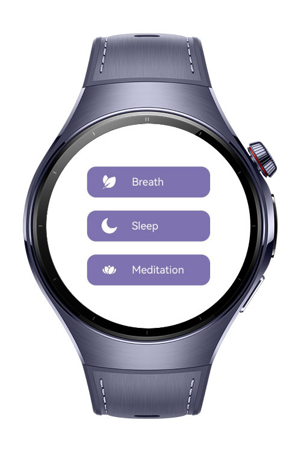
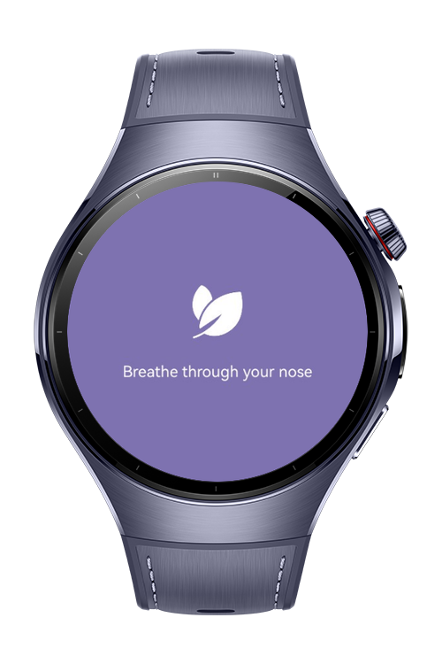
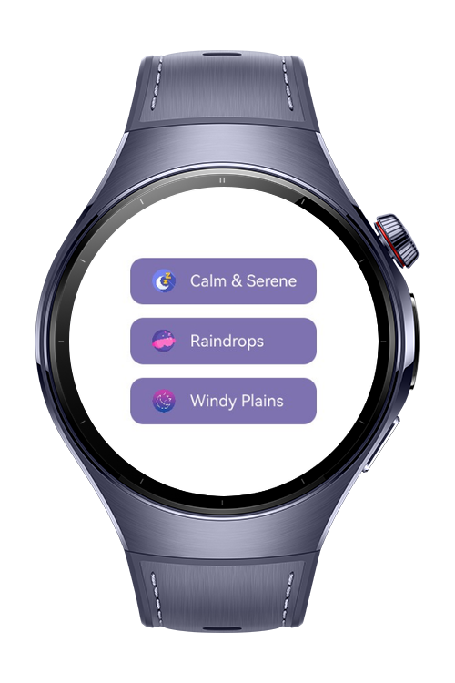
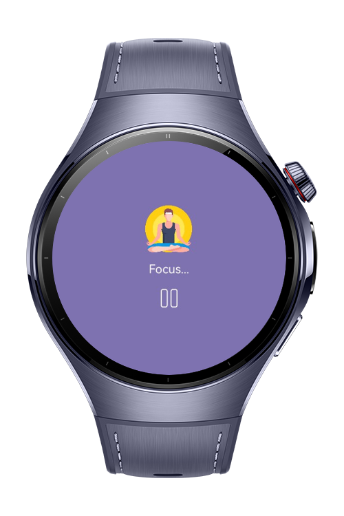

> **Note:** To access all shared projects, get information about environment setup, and view other guides, please visit [Explore-In-HMOS-Wearable Index](https://github.com/Explore-In-HMOS-Wearable/hmos-index).

# Sleep and Relaxation

This demo showcases a sleep and relaxation monitoring app with various features. The app includes the following main
packages and functionalities:

- **model**: Contains data models used by the app.
- **pages**: Provides different pages for meditation, sleep monitoring, and breathing exercises.

The app is designed to be simple and easy to use, providing real-time relaxation and sleep monitoring features.

# Preview

<div>
  
  
  
  
</div>

# Use Cases

- Monitor sleep patterns in real time.
- Access guided meditation sessions for relaxation.
- Perform breathing exercises to reduce stress.
- Navigate easily through dedicated pages for sleep, meditation, and relaxation.

# Tech Stack

- **Languages**: ArkTS, Typescript
- **Frameworks**: HarmonyOS SDK 5.1.0(18)
- **Tools**: DevEco Studio Version 5.1.0.828
- **Libraries**:
    - `@kit.AbilityKit`
    - `@kit.ArkUI`
    - `@kit.PerformanceAnalysisKit`

# Directory Structure

```
├──entry/src/main/ets/
│  ├──model                             // Data model for the app
│  │   └──DataModel.ets                 // Data model for the app
│  ├──components                        // Reusable UI Components
│  ├──entryability
│  │   └──EntryAbility.ets              // Entry ability lifecycle callbacks
│  ├──entrybackupability
│  │   └──EntryBackupAbility.ets        // EntryBackupAbility lifecycle callbacks
│  └──pages                             // Pages
│      ├──BreathPage.ets                // Breath exercise page
│      ├──Index.ets                     // Main home page
│      ├──MeditationPage.ets            // Meditation session page
│      ├──MeditationPlayPage.ets        // Page for playing meditation sessions
│      ├──SleepPage.ets                 // Sleep tracking page
│      └──SleepPlayPage.ets             // Page for playing sleep sounds
└──entry/src/main/resources             // Static resources
```

# Constraints and Restrictions

## Supported Devices

- Huawei Watch 5

# LICENSE

**Sleep and Relaxation** is distributed under the terms of the MIT License.
See the [license](/LICENSE) for more information.